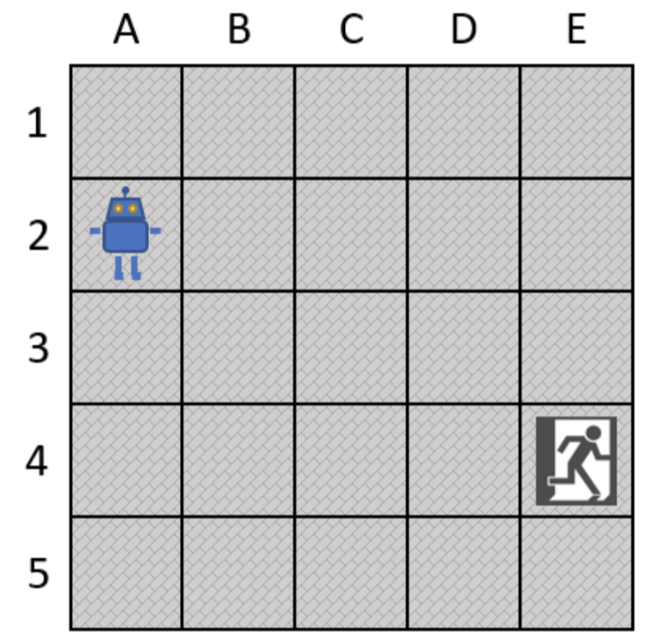

# RL_Escaped_Robot

In this project we will implement a simple Reinforcement Q-Learning algorithm for a robot which tries to escape a room.

## Robot Environment

{:height="700px" width="400px"}

## Reinforcement Learning Process

